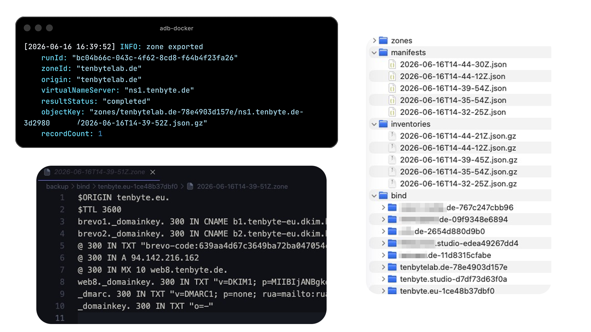

# AutoDNS Backup Client

Export-only backup client for InterNetX AutoDNS DomainRobot DNS zones.



The client only reads existing zones and writes backups. It does not create, update, import, restore
or delete AutoDNS zones. The authoritative backup is compressed JSON; BIND files and Git-friendly JSON
files are additional export formats.

## What It Does

- lists all visible DNS zones via AutoDNS pagination
- fetches full zone detail responses
- supports incremental and full backups
- resumes interrupted runs through SQLite
- writes gzip JSON backups to local storage or S3-compatible storage
- optionally writes stable pretty JSON files for Git diffs
- optionally writes BIND zone files
- verifies stored objects and emits structured logs

## Quickstart

### Docker Image

```bash
docker pull ghcr.io/wiesty/adb:latest
cp .env.example .env
```

Fill `.env`, then run a one-shot backup:

```bash
docker run --rm --env-file .env \
  -e BACKUP_MODE=incremental \
  -v autodns-data:/data \
  -v "$PWD/backup:/backup" \
  -v "$PWD/git-export:/git-export" \
  ghcr.io/wiesty/adb:latest
```

Or run without an `.env` file by passing variables directly:

```bash
docker run --rm \
  -e AUTODNS_BASE_URL=https://api.autodns.com/v1 \
  -e AUTODNS_USERNAME=your-autodns-user \
  -e AUTODNS_PASSWORD=your-autodns-password \
  -e AUTODNS_CONTEXT=4 \
  -e AUTODNS_USER_AGENT=tenbyte-autodns-backup/1.0 \
  -e BACKUP_MODE=incremental \
  -e BACKUP_CONCURRENCY=2 \
  -e BACKUP_REQUESTS_PER_SECOND=2 \
  -e BACKUP_REQUEST_TIMEOUT_MS=30000 \
  -e BACKUP_MAX_RETRIES=5 \
  -e FORCE_REEXPORT_AFTER_DAYS=7 \
  -e MISSING_CONFIRMATION_RUNS=3 \
  -e MAX_INVENTORY_DROP_PERCENT=1 \
  -e MAX_FAILED_ZONES=5 \
  -e INVENTORY_PAGE_SIZE=500 \
  -e DATABASE_PATH=/data/backup.sqlite \
  -e WORK_DIRECTORY=/data/work \
  -e STORAGE_DRIVER=local \
  -e LOCAL_BACKUP_PATH=/backup \
  -e GIT_EXPORT_ENABLED=true \
  -e GIT_EXPORT_PATH=/git-export \
  -e GIT_EXPORT_WRITE_BIND=true \
  -e LOG_LEVEL=info \
  -e LOG_FORMAT=pretty \
  -e LOG_BANNER=true \
  -v autodns-data:/data \
  -v "$PWD/backup:/backup" \
  -v "$PWD/git-export:/git-export" \
  ghcr.io/wiesty/adb:latest
```

For S3-compatible storage, replace the local storage variables with:

```bash
  -e STORAGE_DRIVER=s3 \
  -e S3_ENDPOINT=https://s3.example.com \
  -e S3_REGION=us-east-1 \
  -e S3_BUCKET=dns \
  -e S3_PREFIX=autodns \
  -e S3_ACCESS_KEY_ID=your-access-key \
  -e S3_SECRET_ACCESS_KEY=your-secret-key \
  -e S3_FORCE_PATH_STYLE=true \
  -e S3_SERVER_SIDE_ENCRYPTION= \
  -e S3_KMS_KEY_ID= \
```

Select the command with `BACKUP_MODE`:

```env
BACKUP_MODE=inventory
BACKUP_MODE=incremental
BACKUP_MODE=full
BACKUP_MODE=verify
BACKUP_MODE=status
```

The container is a private one-shot job. It exposes no ports and should not be run as a public
service.

### Local Development

```bash
pnpm install
pnpm build
cp .env.example .env
```

Fill `.env`, then run:

```bash
npm run start -- inventory
npm run start -- incremental
npm run start -- verify
```

Local Docker build:

```bash
docker build -t ghcr.io/wiesty/adb:local .
docker run --rm --env-file .env \
  -e BACKUP_MODE=incremental \
  -v autodns-data:/data \
  -v "$PWD/backup:/backup" \
  -v "$PWD/git-export:/git-export" \
  ghcr.io/wiesty/adb:local
```

## CLI

```bash
autodns-backup inventory
autodns-backup incremental
autodns-backup full
autodns-backup verify
autodns-backup status
autodns-backup export-bind --zone example.com
autodns-backup restore-preview --zone example.com
```

`restore-preview` only shows available backup data. There is no automatic restore command.

## Docs

The extended documentation is written so each page can be copied directly into a GitHub Wiki. Suggested
wiki page names:

- [Home](https://github.com/wiesty/adb/wiki)
- [Configuration](https://github.com/wiesty/adb/wiki/Configuration)
- [Licensing](https://github.com/wiesty/adb/wiki/Licensing)
- [Docker Image](https://github.com/wiesty/adb/wiki/Docker-Image)
- [AutoDNS API](https://github.com/wiesty/adb/wiki/AutoDNS-API)
- [AutoDNS Permissions](https://github.com/wiesty/adb/wiki/AutoDNS-Permissions)
- [Backup Format](https://github.com/wiesty/adb/wiki/Backup-Format)
- [Storage](https://github.com/wiesty/adb/wiki/Storage)
- [Git Export](https://github.com/wiesty/adb/wiki/Git-Export)
- [Operations](https://github.com/wiesty/adb/wiki/Operations)
- [Security](https://github.com/wiesty/adb/wiki/Security)

## Important Defaults

```env
BACKUP_CONCURRENCY=2
BACKUP_REQUESTS_PER_SECOND=2
BACKUP_REQUEST_TIMEOUT_MS=30000
BACKUP_MAX_RETRIES=5
FORCE_REEXPORT_AFTER_DAYS=7
STORAGE_DRIVER=s3
GIT_EXPORT_ENABLED=true
LOG_FORMAT=pretty
LOG_BANNER=true
```

AutoDNS documents 3 requests per second per IP. This client defaults to 2.

## Safety Notes

- Use a dedicated AutoDNS API user with read-only permissions.
- Run the container only in a private environment; do not expose it publicly.
- Do not pass credentials as CLI arguments.
- Secrets are not written to SQLite, manifests, backups, logs or webhook payloads.
- The client never deletes backup objects.
- DNS zone data can be sensitive; push `git-export/` only to private repositories.
- See [Security](SECURITY.md).

## Validation

```bash
pnpm lint
pnpm typecheck
pnpm test
pnpm build
```
